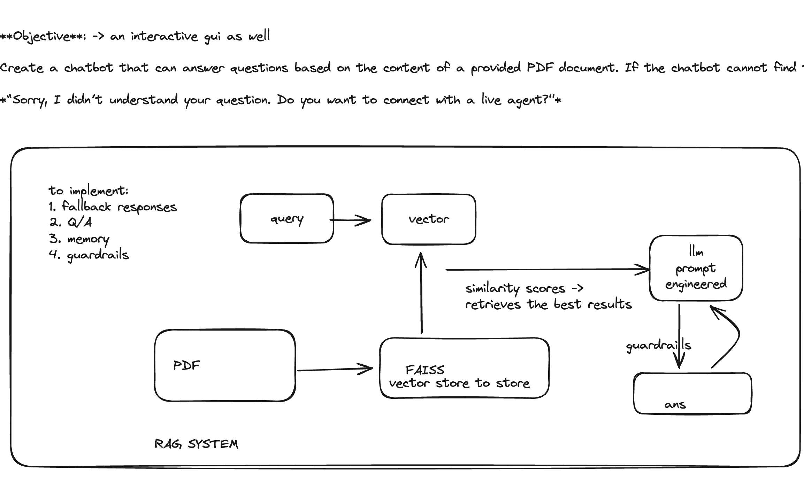

quicksell assignment

the flow will be something like this

rag app which is also hosted and must be a chatbot with memory



---

## **Project Overview**

This project implements a chatbot with memory, leveraging a Retrieval-Augmented Generation (RAG) architecture to answer user queries based on a provided dataset (`input.pdf`). The chatbot uses OpenAI's GPT model for natural language understanding and response generation.

---

## **Key Features**

* **Data Ingestion** : Reads and processes PDF files into manageable chunks.
* **RAG Architecture** : Enhances query responses by combining retrieval with generative models.
* **Chatbot Memory** : Utilizes conversational memory to generate context-aware responses.
* **Guardrails** (Commented Out): Placeholder code for implementing validation, such as profanity checks, in the future.

---

## **File Descriptions**

### **1. `app.py`**

* **Purpose** : Main entry point for the Streamlit-based chatbot interface.
* **Key Functionality** :
* Takes user input through a text area.
* Sends input to the LLM for processing and displays the response.

### **2. `ingester.py`**

* **Purpose** : Handles document ingestion, splitting, and vector storage.
* **Key Functions** :
* `dataLoader`: Reads the PDF file and converts it into raw text documents.
* `dataSplitter`: Splits the documents into chunks for efficient processing.
* `vectorStoreCreator`: Creates a vector store using OpenAI embeddings.

### **3. `llm.py`**

* **Purpose** : Implements the chatbot logic and RAG pipeline.
* **Key Functions** :
* `chatbotLLM`:
  * Loads and splits documents.
  * Creates a history-aware retriever.
  * Combines document retrieval and generative answering using chains.
* Uses LangChain's `ChatOpenAI` with GPT-4 model configuration.

### **4. `prompts.py`**

* **Purpose** : Stores templates for chatbot prompts.
* **Prompt Design** :
* Ensures concise answers with references.
* Includes fallback responses for irrelevant questions.

---

## **Setup Instructions**

### **Prerequisites**

* Python 3.9+
* OpenAI API key
* Necessary libraries from `requirements.txt`

### **Installation**

1. Clone the repository:
   ```bash
   git clone <repository_url>
   cd chatbot_doc-main
   ```
2. Install dependencies:
   ```bash
   pip install -r requirements.txt
   ```
3. Set up environment variables:
   * Create a `.env` file in the root directory:
     ```env
     OPENAI_API_KEY=your_openai_api_key
     LANGCHAIN_API_KEY=your_langchain_api_key
     LANGCHAIN_ENDPOINT=https://api.smith.langchain.com
     ```

### **Usage**

1. Run the chatbot:
   ```bash
   streamlit run app.py
   ```
2. Input your query in the Streamlit interface.
3. The chatbot will respond with answers sourced from `input.pdf`.

---

## **Future Enhancements**

* Add **guardrails** for profanity filtering and better validation.
* Improve chatbot memory for long conversations.
* Support additional file formats beyond PDF.
